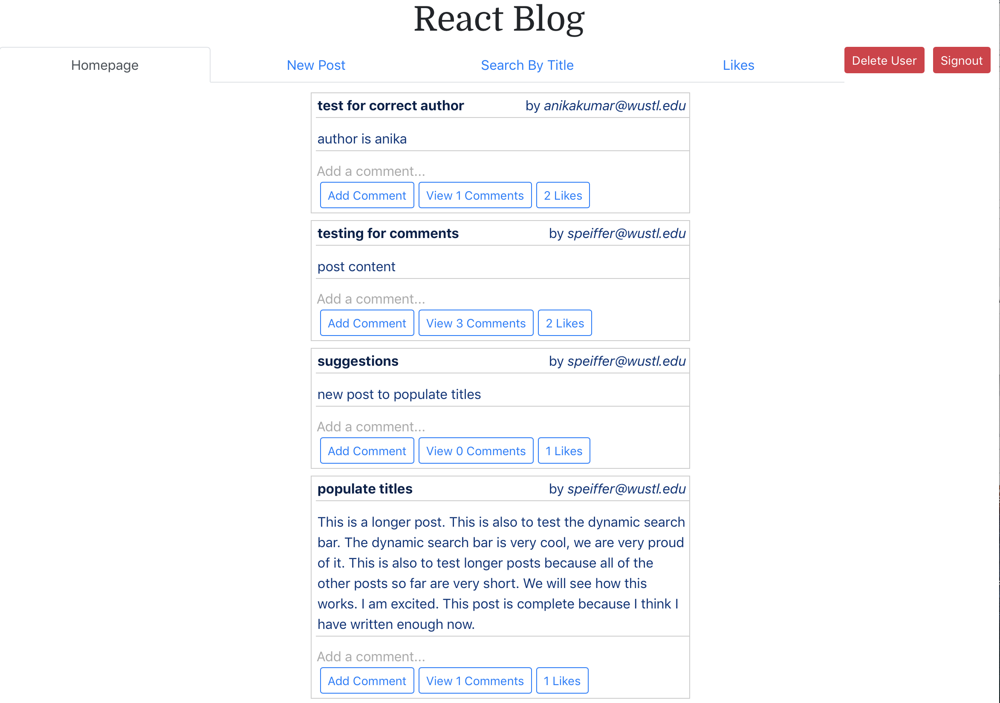
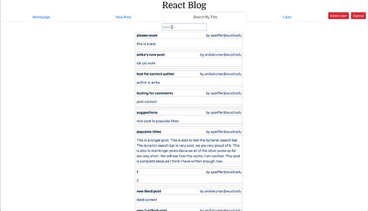

#  React Blog
Authors: Anika Kumar, Sarah Peiffer
 Built for Washington University in St. Louis CSE 330 (Rapid Prototype Developement and Creative Programming)

## Login Details - Registered Users and Passwords:
* anika@kumar.us: anika123 (Feel free to register a new user)

## Description
Implemented a blog where users can upload and delete post and comments. Utilized Firebase to blog post data, such as author, post content, comments, and likes. Uses Firebase user authentication to verify user emails and encrypt passwords. Users will be able to all posts created on the blog including posts created by other users. Uses JavaScript and React framework to create, edit, delete, and comment on posts without ever refreshing the brower after the initial web page load. Uses Bootstrap for styling and navigation tabs. 

## Features
### Dynamic Search Bar
Users can search for posts by title. This search bar filters through post titles and updates dynamically. 
### Likes
Users can like posts created by other user and their own posts. A user cannot like a post more than once. 

Clip of Dynamic Search Bar

